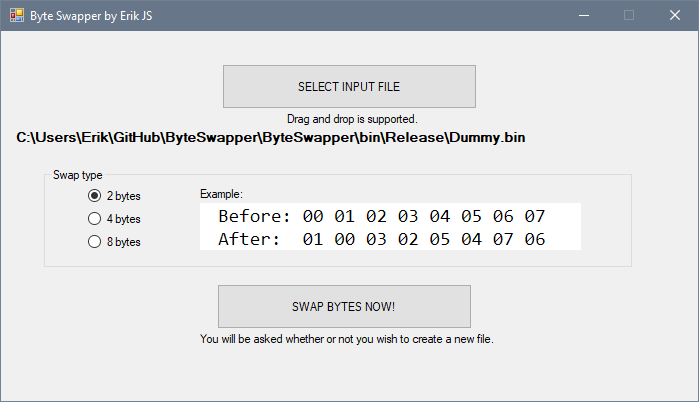

# Byte Swapper
Bullshitless byte swapper. 
Author: [Erik JS](https://github.com/Erik-JS)

See below. If this isn't what you're looking for then you're in the wrong repository.

-----------------------------------------------------------

## Example

Original file has 16 bytes with the following content: `00 01 02 03 04 05 06 07 08 09 0A 0B 0C 0D 0E 0F`

2 bytes swap:  `01 00 03 02 05 04 07 06 09 08 0B 0A 0D 0C 0F 0E`

4 bytes swap:  `03 02 01 00 07 06 05 04 0B 0A 09 08 0F 0E 0D 0C`

8 bytes swap:  `07 06 05 04 03 02 01 00 0F 0E 0D 0C 0B 0A 09 08`

-----------------------------------------------------------

## Interface

